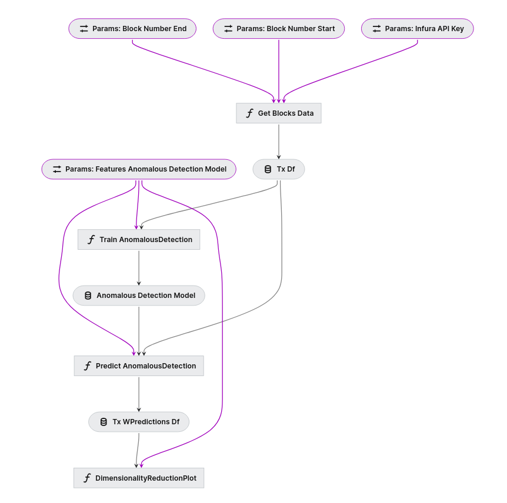
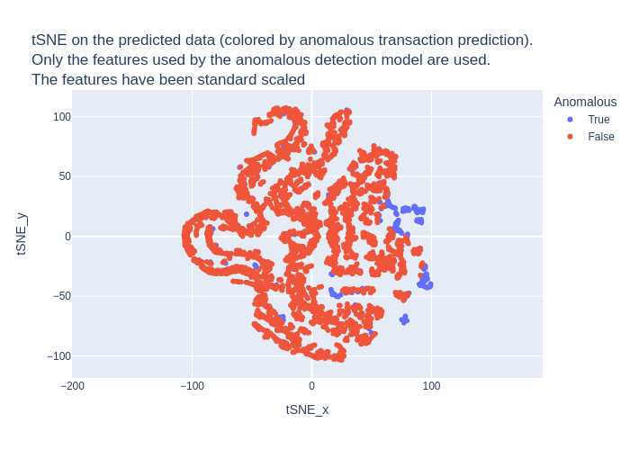

# Anomalous Ethereum Transactions

Developement of a system that detects anomalous Ethereum transactions.

## Overview

This project was generated using `Kedro 0.18.13`.

If you are new to Kedro, take a look at the [Kedro documentation](https://kedro.readthedocs.io) to get started. But in summary :

* Kedro nodes are the building blocks of pipelines. A node is a wrapper for a Python function that names the inputs and outputs of that function.

* A pipeline organises the dependencies and execution order of a collection of nodes.

* Kedro has a registry of all data sources the project can use called the Data Catalog. There is inbuilt support for various file types and file systems.

* Kedro projects follow a default template that uses specific folders to store datasets, notebooks, configuration and source code.

The structure of this project is as follows:

    project-dir         # Parent directory of the template
    ├── .gitignore      # Hidden file that prevents staging of unnecessary files to `git`
    ├── conf            # Project configuration files :
        ├── base        # Project-specific settings to share across different installations / users
        └── local       # Settings specific to each user and installation and its contents ignored by git across different
    ├── data            # Local project data
    ├── docs            # Project documentation
    ├── notebooks       # Project-related Jupyter notebooks (can be used for experimental code before moving the code to src)
    ├── pyproject.toml  # Identifies the project root and contains configuration information
    ├── requirements    # Conda environment
    ├── README.md       # Project README
    └── src             # Project source code (with pipelines and nodes)
    

## Docker

**Build the Docker Image:**

Open a terminal, navigate to the directory containing your Dockerfile, and run the following command to build the Docker image:

```
docker build -t kedro-anomalous-image .
```

**Run a Docker Container:**

After the image is built successfully, you can run a Docker container from the image using the following command:

```
docker run -it --rm -v /absolute_path/on/host/anomalous-ethereum-transactions:/anomalous-ethereum-transactions kedro-anomalous-image /bin/bash
```

Then, you can run every kedro command (like `kedro run`) inside the docker.
To exit the container, just type `exit`.


## Create and setup environment if you are not using Docker

First create and activate your conda env.
```
conda env create -f requirements/anomalous-transactions-env-freeze.yml python=3.7
conda activate anomalous-transactions-env-freeze
```

## How to run Kedro pipelines

You can run the entire Kedro project with:

```
kedro run
```

This command will retreive transactions data for a list of blocks, train a model to predict anomalous transactions and predict those transactions.

You can visualise Kedro pipelines with :
```
kedro viz
```



## Architecture of pipelines

There are two main pipelines :

### Data Processing Pipeline
Retreive transactions data for a list of blocks using Infura.

The pipeline is located in `src/anomalous_ethereum_transactions/pipelines/data_processing/pipeline.py`.

The nodes are located in `src/anomalous_ethereum_transactions/pipelines/data_processing/nodes.py`


**Inputs** : 

**`block_number_start`**: number of the starting block. You can modify it inside `conf/base/parameters_data_processing.yml`.

**`block_number_end`**: number of the ending block. You can modify it inside `conf/base/parameters_data_processing.yml`.

**`infura_API_key`** : Infura API key. You can store your API key inside the local conf `conf/local/parameters_data_processing.yml`.

**Output** : 

**`tx_df`**: Dataframe of all the transactions inside these blocks. Only these features are kept :  hash, blockNumber, gas, gasUsed, gasPrice, maxFeePerGas, maxPriorityFeePerGas, nonce, transactionIndex, type, value, transactionRank, and transactionPrice. A csv file is saved inside `data/02_intermediate/tx_df.csv`.
    
If you want to run only the data_processing pipeline, you can run :
```
kedro run --pipeline data_recovery
```
If you want to change the input parameters, you can modify `conf/base/parameters_data_processing.yml` file. Otherwise, you can directly overwrite them with this command line :
```
kedro run --pipeline data_recovery --params "block_number_start=18183000,block_number_end=18183001"
```

### Data Science Pipeline

The pipeline is located in `src/anomalous_ethereum_transactions/pipelines/data_science/pipeline.py`.

The nodes are located in `src/anomalous_ethereum_transactions/pipelines/data_science/nodes.py`

This pipeline is splitted into two sub-pipelines :

#### `Train pipeline`
It trains an anomalous transaction detection model.

**Inputs** : 

`tx_df`: the dataframe with all the transactions used for training the model.

`features_anomalous_detection_model`: List of the features used to train the model. You can modify it inside `conf/base/parameters_data_science.yml`

**Output** : 

`anomalous_detection_model`: The trained model (Isolation Forest). The model is saved with pickle at `data/06_models/anomalous_detection_model.pkl `


#### `Predict pipeline`
It predicts anomalous transactions based on the trained model.

**Inputs** : 

`tx_df`: the dataframe with all the transactions we want to predict.

`features_anomalous_detection_model`: List of the features used to train the model.

`anomalous_detection_model`: The trained model (Isolation Forest).

**Outputs** : 


`tx_wPredictions_df`: the dataframe of the transactions with all the predictions. It is saved in `data/07_model_output/tx_wPredictions_df.csv`.

`t-SNE plot`: A t-SNE plot colored by the anomalous prediction. It is saved in `data/08_reporting/tSNE_on_predicted_data.html`

### How to run the different pipelines ?

If you want to recover data, train and predict the model, you can run :
```
kedro run --pipeline data_recovery_train_and_predict
```
It's the same as 
```
kedro run
```
<br/>
If you have already recovered the data and train a model, you can simply run :

```
kedro run --pipeline only_predict
```

<br/>

Now, if you want to train the model on specific blocks, and then predict on different blocks, you can run these two lines :

```
kedro run --pipeline data_recovery_train_and_predict --params "block_number_start=18183000,block_number_end=18183050"
kedro run --pipeline data_recovery_predict --params "block_number_start=18183051,block_number_end=18183061"
```
These lines will train a model on blocks 18183000 to 18183050, and then use this saved model (the most recently trained model) to predict on blocks 18183051 to 18183061. 

Please take a look at `src/anomalous-ethereum-transactions/pipeline_registry.py`, if you want to see all the different pipelines, and if you want to modify them.

## Discussion on the model

Isolation Forest is an ensemble-based anomaly detection algorithm that isolates anomalies by building a forest of random decision trees. This model is efficient and can handle large datasets with high-dimensional features. Also it doesn't require a lot of parameter tuning.

The features used are gasPrice,transactionPrice, transactionRank, and value. The transactionRank is equal to transactionIndex / total number of transactions in the block. 
Also I decided to recover the "gas used" because it provides good information on the rewards available to miners.

Here is an example of the abnormal predictions we obtain for transactions in the 18183000 blocks at 18183050. The model was trained on these data. 


We can say that there are several types of transaction, and that there are several sub-groups of abnormal transactions. In order to better identify them, we can try to define what characterises each sub-group of abnormal transactions.

## Next steps

* Unit testing and CI/CD
* Package the project. ([Further information about packaging a kedro project](https://kedro.readthedocs.io/en/stable/tutorial/package_a_project.html))
* Integrate MLflow
* Find the right metrics to evaluate the model
* Implement One-Class SVM model to see if it improves the model performance.
* Identify sub-group of abnormal transactions

